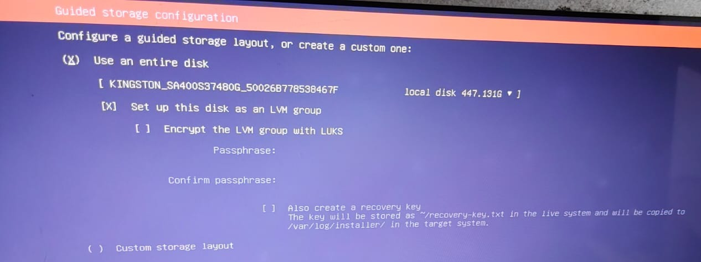
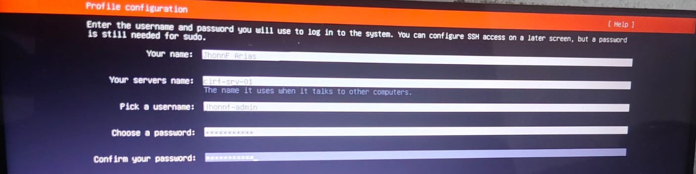
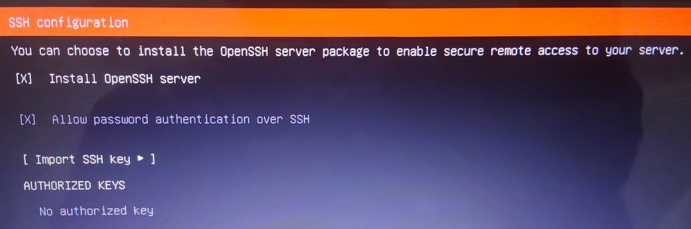

# Fase 1.1: Despliegue Bare-Metal (Ubuntu Server 24.04 LTS)

## Descripción General
Despliegue de un nodo de seguridad dedicado en hardware físico para servir como núcleo del **Critical Infrastructure Resilience Framework (CIRF)**.

## Especificaciones del Despliegue
* **Nombre del Host:** `cirf-srv-01`
* **Sistema Operativo:** Ubuntu 24.04 LTS (Noble Numbat)
* **Arquitectura de Almacenamiento:** LVM (Logical Volume Management) para escalabilidad.
* **Vector de Acceso:** Servidor OpenSSH habilitado para gestión remota segura.

## Hitos de la Instalación

### 1. Esquema de Almacenamiento
Implementación de LVM en un SSD Kingston de 480GB para asegurar la flexibilidad de los volúmenes lógicos y la integridad de los datos.

### 2. Identidad del Sistema
Configuración de la identidad del nodo siguiendo convenciones de nomenclatura corporativas para facilitar la auditoría y gestión de activos.

### 3. Base de Seguridad (SSH)
Activación del servicio OpenSSH para permitir la administración remota cifrada desde el primer arranque, eliminando la necesidad de acceso físico directo.

### 4. Finalización Exitosa
Instalación base del sistema operativo completada y verificada, lista para el aprovisionamiento de red y hardening de seguridad.
![Éxito de Instalación]
