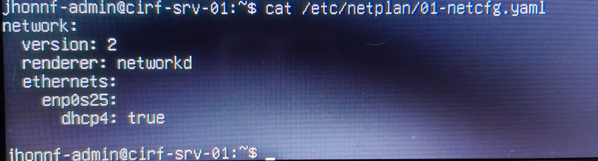
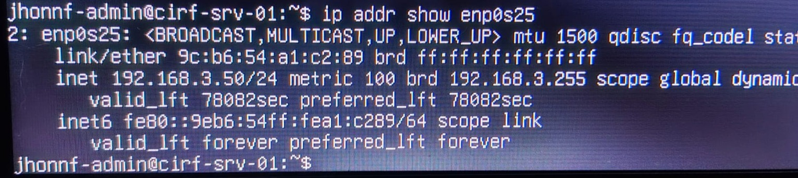
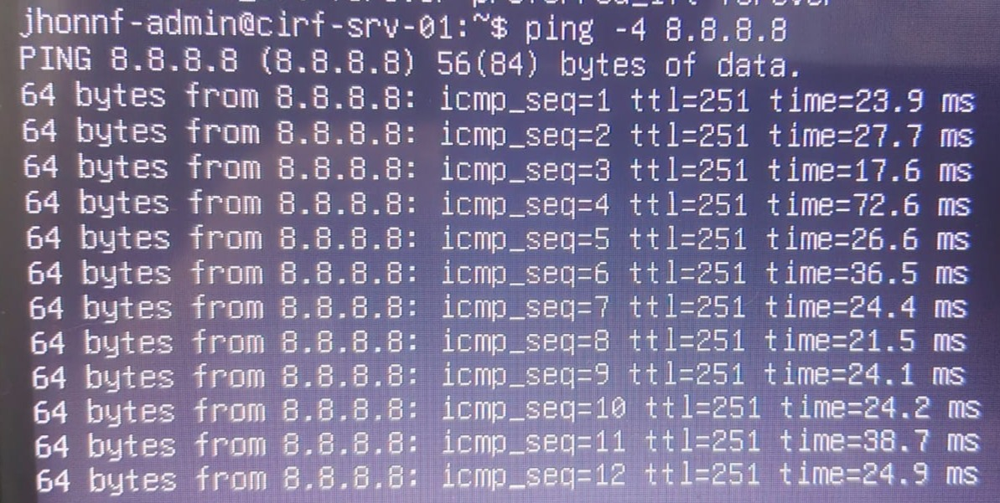
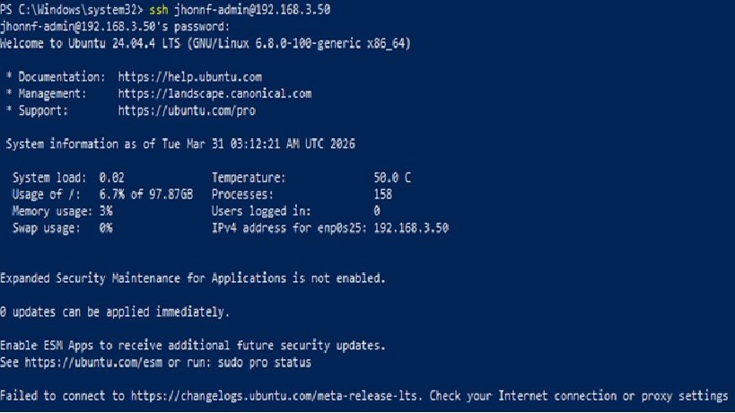

# Fase 1.2: Aprovisionamiento de Red Manual (Netplan)

## Desafío Técnico
Durante la instalación offline, el instalador de Ubuntu no generó los archivos de configuración de red, dejando el nodo sin conectividad y con el stack de red vacío.

## Resolución (Troubleshooting)
Se procedió a realizar una configuración manual del subsistema de red para habilitar el handshake DHCP con el router local.

### 1. Reconstrucción de la Configuración
Se creó manualmente el archivo de configuración Netplan definiendo la interfaz física `enp0s25` y habilitando el protocolo IPv4 dinámico.

### 2. Validación de Interfaz
Tras aplicar los cambios con `netplan apply`, se verificó la asignación correcta de la dirección IP privada dentro del segmento de la red local.

### 3. Prueba de Enlace Global
Verificación de la salida a internet y resolución de nombres mediante pruebas de ICMP (Ping) hacia servidores DNS externos.

### 4. Validación de Acceso Remoto (SSH)
Como prueba final de conectividad y funcionalidad del servicio, se realizó una conexión exitosa desde una estación de trabajo externa utilizando el protocolo SSH. Esto confirma que el server está listo para ser gestionado de forma "Headless" (sin monitor físico).

